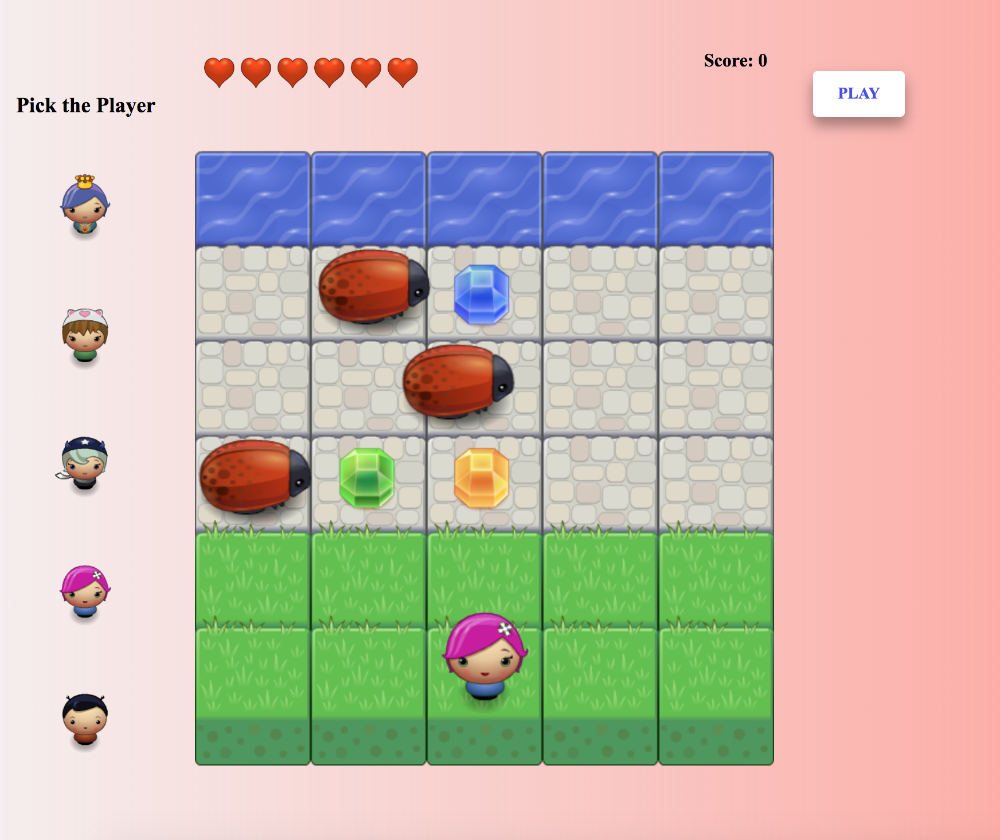

# Classic Arcade Game

This is the project for Udacity's [ Front-End Web Developer](https://www.udacity.com/course/front-end-web-developer-nanodegree--nd001) Nanodegree Program. It was developed using HTMl, CSS, and JavaScript. It focuses on object-oriented programming.
The project is a clone of a game called FROGGER.
The [starter code](https://github.com/udacity/frontend-nanodegree-arcade-game) provides art assets and game engine.

## Table of Contents

- [Project Overview](#project-overview)
- [Instructions](#instructions)
- [Dependencies](#dependencies)
- [Installation](#installation)
- [Live Preview](#live-preview)
- [Screenshots](#screenshots)

## Project Overview

In this game you have a Player and Enemies (bugs). The goal of the player is to reach the water, without colliding into any one of the enemies.
The player can move left, right, up and down
The enemies move at varying speeds on the paved block portion of the game board
Once the player collides with an enemy, the game is reset and the player moves back to the starting square


###  Instructions

  - Click on the start button of the welcome modal.
  - Pick the player by clicking on the avatar.
  - Click on play button.
  - To move the player, use your keyboards' up, right, down and left arrow keys.
  - In order to win, you need to reach the water without having any collision with the bugs.


###  Dependencies

- vanilla.js
- Object Oriented JavaScript
- CSS3
- HTML5  
- HTML5 Canvas

## Installation

  1. Download or clone the repository
  ```
    - git clone git@github.com:ShaggyT/arcade-game.git
    - cd arcade-game
  ```
  2. Open the folder and right click on ```index.html``` and choose a browser

  3. View in your browser

###  Live Preview
To play the game, [Click Here!](https://froggerudacity.netlify.com)

###  Screenshots


